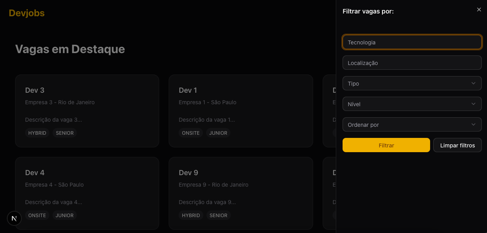
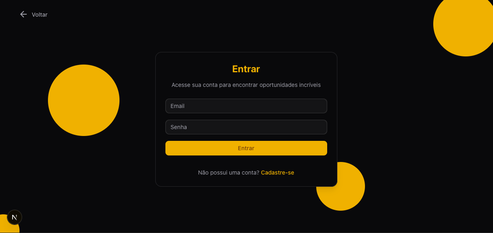
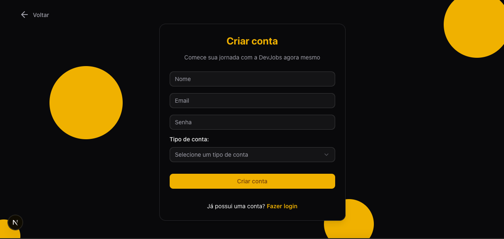
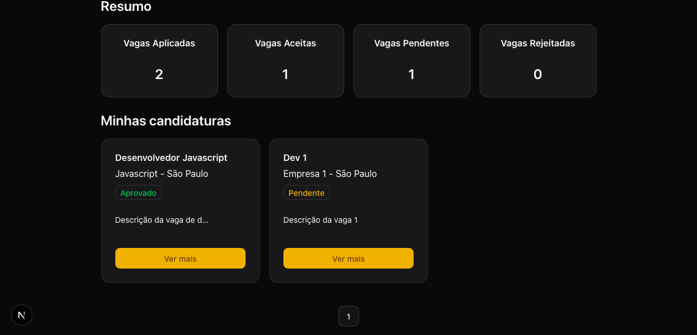
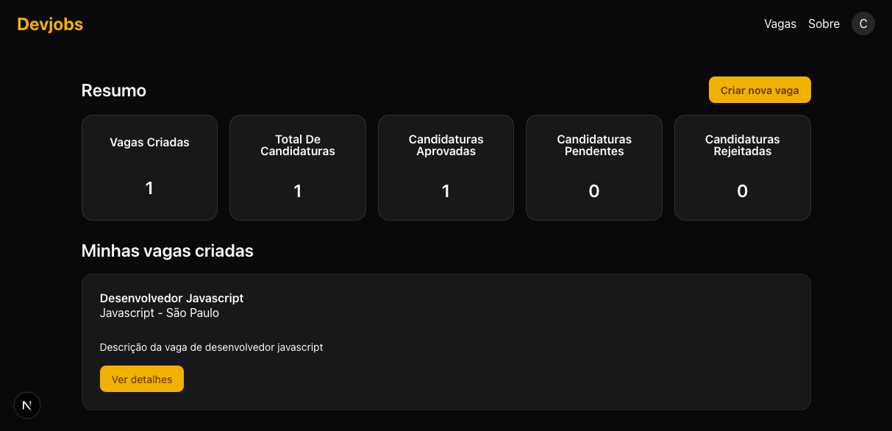
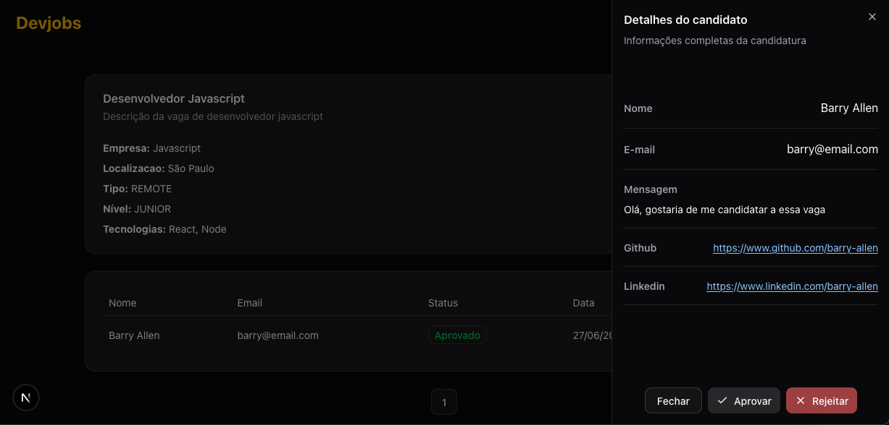
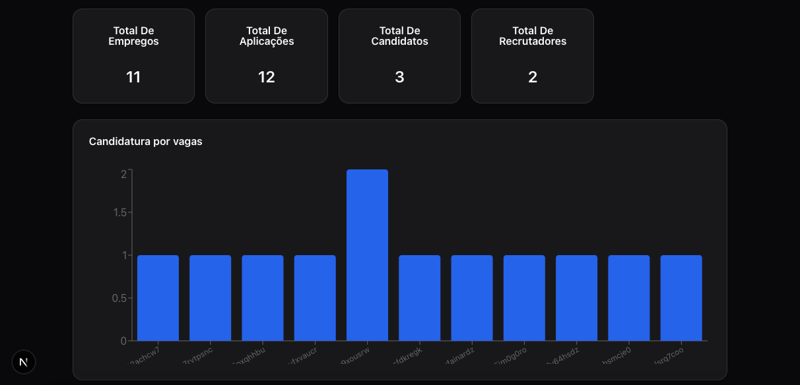
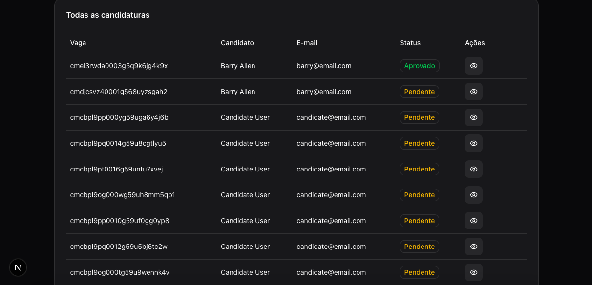

# 💼 DevJobs

O **DevJobs** é uma plataforma moderna de gestão e busca de vagas de emprego na área de tecnologia.  
Desenvolvido para **Candidatos, Recrutadores e Administradores**, o sistema cobre todo o fluxo: desde candidaturas simples até dashboards completos para gestão de vagas e estatísticas.

---

## 🖼️ Preview da Aplicação

### Página Inicial


### Login


### Cadastro/Register


### Dashboard do Candidato


### Dashboard do Recrutador



### Dashboard do Admin




---


## ✨ Funcionalidades

### 👩‍💻 Candidato
- Criar conta e autenticar-se (login/register).
- Navegar e se candidatar a vagas.
- Acompanhar status de candidaturas (PENDENTE, ACEITA, REJEITADA).
- Dashboard com resumo + candidaturas listadas.

### 🧑‍💼 Recrutador
- Criar e gerenciar vagas de emprego.
- Visualizar candidatos aplicados em cada vaga.
- Alterar status das candidaturas (aprovar/rejeitar).
- Dashboard com estatísticas de vagas + candidaturas.

### 🛡️ Administrador
- Acompanhar todas as vagas e candidaturas.
- Visualizar estatísticas globais (ex: candidaturas por vaga).
- Dashboard com **gráficos** + **tabelas** para análise.

---

## 🛠️ Tecnologias

### Frontend
- [Next.js 13+ (App Router)](https://nextjs.org/)
- [React](https://react.dev/)
- [React Query (TanStack)](https://tanstack.com/query/latest)
- [React Hook Form](https://react-hook-form.com/)
- [Zod](https://zod.dev/) (validação)
- [Tailwind CSS](https://tailwindcss.com/)
- [shadcn/ui](https://ui.shadcn.com/) (componentes)
- [Sonner](https://sonner.emilkowal.ski/) (toasts)
- [Playwright](https://playwright.dev/) (testes e2e)

### Backend
- [Node.js](https://nodejs.org/)
- [Fastify](https://fastify.dev/)
- [Prisma ORM](https://www.prisma.io/)
- [PostgreSQL (Bitnami)](https://hub.docker.com/r/bitnami/postgresql)
- [Redis](https://redis.io/) (cache/sessões)
- [JWT](https://jwt.io/) (auth e refresh token)

### Infra
- [Docker](https://www.docker.com/)
- [Docker Compose](https://docs.docker.com/compose/)
- [TypeScript](https://www.typescriptlang.org/)

---

## ⚡ Pré-requisitos

- [Node.js >= 18](https://nodejs.org/)
- [Docker](https://www.docker.com/)
- [Docker Compose](https://docs.docker.com/compose/)

---

## No Frontend

### 🚀 Instalação

Clone o repositório:

```sh
git clone https://github.com/seu-usuario/devjobs.git

```

### Entre no diretório do projeto:

```sh
cd web
```

### Instale as dependências:

```sh
npm install
```

### Copie o arquivo `.env.example` para `.env`

```sh

cp .env.example .env

```

### Inicie o servidor:

```sh
npm run dev
```

### Rodar os testes:

```sh
npm run test
```

Acesse a aplicação em http://localhost:3000.

---

## No Backend

### Entre no diretório do projeto:

```sh
cd backend
```

### Instale as dependências:

```sh
npm install
```

### Copie o arquivo `.env.example` para `.env`

```sh

cp .env.example .env

```

### Inicie o docker-compose:

```sh
docker compose up -d
```

### Rodar as migrações do Prisma:

```sh
npx prisma migrate dev
```

### Inicie o servidor:

```sh
npm run dev
```

### Rodar os testes:

```sh
npm run test
```

Acesse a aplicação em http://localhost:3333.

---

## Contribua

Acesse o repositório do projeto no GitHub:

https://github.com/Gui-dev/devjobs

Siga o guia de contribuição para contribuir com o projeto.

1- Faça um fork do projeto.

2- Crie sua branch (git checkout -b feature/nova-feature).

3 - Commit suas mudanças (git commit -m 'feat: adiciona nova feature').

4 - Faça push da branch (git push origin feature/nova-feature).

5 - Abra um Pull Request.

---

## Licença

O projeto está licenciado sob a licenca MIT. Leia o arquivo `LICENSE` para mais detalhes.
